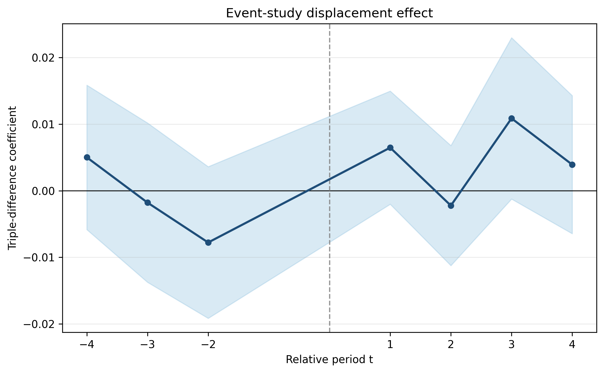
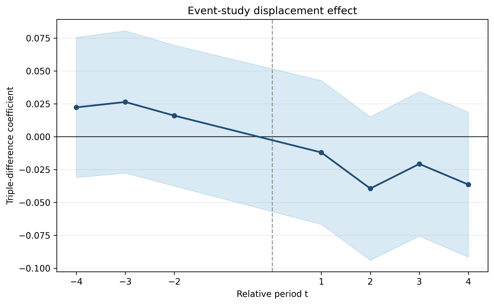
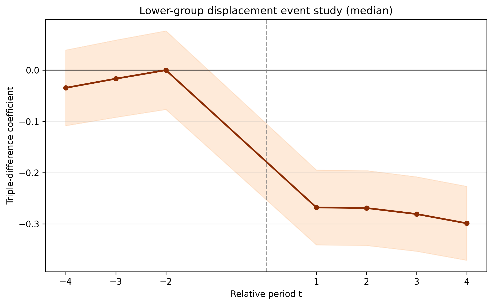
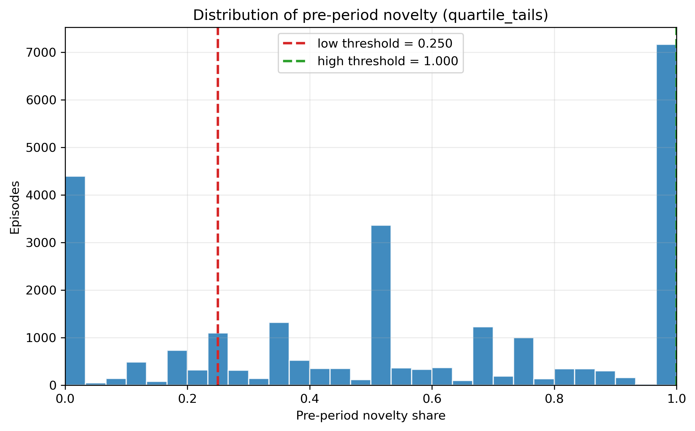
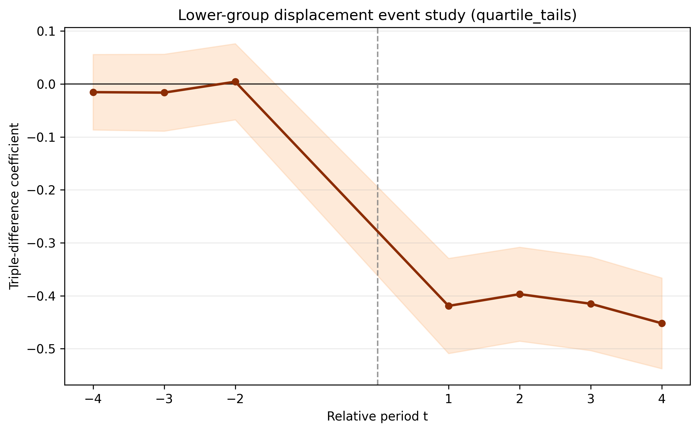
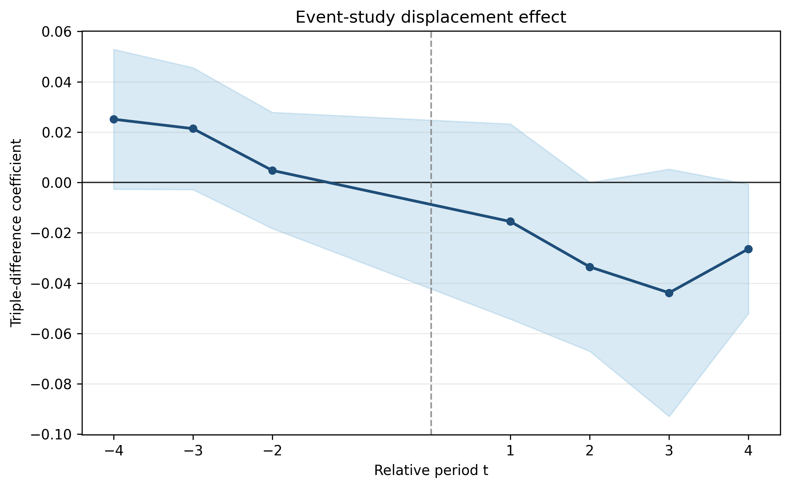

# The Question

When a store closes temporarily, do customers who wanted to buy but could not break their coffee habit? Or do they return as if the interruption never happened?

The standard intuition is that habits are fragile: if a planned purchase is missed, the routine weakens and future demand falls. We test that idea using temporary store closures at a large coffee chain. The key distinction is between customers whose routine was actually interrupted and customers who happened not to need a purchase during the closure window.

We study two outcomes:

- **How much customers buy after reopening** — does a blocked purchase reduce future purchase frequency?
- **What customers buy after reopening** — does interruption change whether customers try new products?

# Setting and Data

The coffee chain is a Chinese quick-service brand whose purchases are made primarily through a mobile app. Our transaction data cover June 2020 to December 2021 and include 10.6 million transactions from 779,000 customers.

For the analysis sample in this report, we study **18 unexpected store closures** and assign customers to treatment or control according to which store they visited most before the closure:

- **Treatment group** — customers whose preferred store closed
- **Control group** — customers whose preferred matched store remained open

The matching proceeds as follows:

- For each closure, identify candidate control stores that are untreated, not already assigned as controls for an earlier closure, and not excluded by address keywords.
- Match the treated store to **five** control stores with the closest **store set-up times**.
- Define treatment customers as members whose preferred pre-closure store is the closing store.
- Define control customers as members whose preferred pre-closure store is one of the matched control stores.
- In both groups, require at least **5** pre-closure purchase days and a preferred-store purchase share of at least **0.8**.

The resulting panel contains **40,148 member-event pairs** and **321,184 member-event-period observations** for purchase frequency. For novelty-seeking, the estimation sample is smaller (**99,644 observations**) because the outcome is defined only in periods with at least one purchase.

The closure-level registry is:

| dept_id | closure_start | closure_end | n_control_stores | n_treatment | n_control |
|---:|:---|:---|---:|---:|---:|
| 8 | 2021-05-27 | 2021-06-10 | 5 | 132 | 598 |
| 19 | 2021-07-15 | 2021-07-25 | 5 | 597 | 2,764 |
| 124 | 2021-07-22 | 2021-08-18 | 5 | 1,291 | 2,029 |
| 238 | 2021-07-24 | 2021-08-21 | 5 | 773 | 1,059 |
| 44 | 2021-07-24 | 2021-08-05 | 5 | 367 | 1,231 |
| 39 | 2021-07-25 | 2021-08-19 | 5 | 253 | 2,890 |
| 246 | 2021-07-27 | 2021-08-08 | 5 | 76 | 481 |
| 133 | 2021-07-28 | 2021-08-22 | 5 | 228 | 2,128 |
| 47 | 2021-07-30 | 2021-08-10 | 5 | 223 | 3,241 |
| 121 | 2021-08-03 | 2021-08-20 | 5 | 418 | 1,890 |
| 182 | 2021-08-03 | 2021-08-20 | 5 | 221 | 1,422 |
| 220 | 2021-08-03 | 2021-08-12 | 5 | 599 | 1,261 |
| 59 | 2021-08-03 | 2021-08-19 | 5 | 423 | 2,908 |
| 46 | 2021-08-04 | 2021-08-19 | 5 | 313 | 2,495 |
| 62 | 2021-08-04 | 2021-08-17 | 5 | 231 | 2,485 |
| 3 | 2021-08-09 | 2021-08-22 | 5 | 734 | 819 |
| 5 | 2021-08-18 | 2021-08-31 | 5 | 432 | 2,056 |
| 131 | 2021-08-29 | 2021-09-08 | 5 | 408 | 2,350 |

# The Key Distinction: Blocked Buyers as Active Purchase Goals

Not every treatment customer would have bought during the closure even if the store had stayed open. Only customers with a purchase due in that window were truly interrupted. We call them **blocked buyers**.

Conceptually, the blocked-buyer indicator is not just a proxy for being a heavy user. It is a revealed-preference proxy for an **active purchase goal**. Repeated coffee purchases can reflect a chronically active consumption goal rather than mere inertia, and recent action can push customers into an implemental mindset that makes follow-through more likely [Kruglanski and Szumowska (2020); Kruglanski et al. (2002); Dhar, Huber, and Khan (2007); Gollwitzer (1990)].

We classify each member-event pair using an XGBoost model trained only on pre-closure behavior. The model predicts whether the customer would have made a purchase during the closure window absent disruption, and it achieves about **73% accuracy** on pre-treatment data.

This distinction is central. If interruption damages habit, the effect should appear most clearly among blocked buyers, because they are the customers whose active purchase goal was actually obstructed.

# Research Design

## Outcomes

Let $L_e$ denote the duration of closure event $e$.

- **Purchase frequency**:

$$
Y^P_{iet} = \frac{\text{purchase days}_{iet}}{L_e}
$$

This is purchase days per calendar day within each event-length window.

- **Novelty-seeking**:

$$
Y^V_{iet} = \frac{\text{new products}_{iet}}{\text{total products}_{iet}}
$$

where a product is "new" if the member's first-ever purchase of that product occurs in that window. Members with no purchases in a window have missing novelty outcomes for that period.

- **Market-new share (distinct-only-new).** As a chain-level robustness check, we define a second variety-style outcome. Let $\mathcal{P}_{iet}$ be the set of distinct products member $i$ purchases in event period $t$ (relative window) for closure $e$, and let $F(p)$ be the calendar date of product $p$'s **global** first sale in the chain. Let $W^{\mathrm{curr}}_{et}$ and $W^{\mathrm{prev}}_{et}$ be the calendar date ranges of the current event-time bin and the **chronologically previous** estimation bin (the panel omits $rel_t=0$; for the leftmost pre bin there is no previous bin, so only $W^{\mathrm{curr}}_{et}$ is used). Then

$$
Y^{N}_{iet} = \frac{\left|\left\{ p \in \mathcal{P}_{iet} : F(p) \in W^{\mathrm{prev}}_{et} \cup W^{\mathrm{curr}}_{et} \right\}\right|}{\left|\mathcal{P}_{iet}\right|},
$$

with the same missingness rule when $\mathcal{P}_{iet}$ is empty. When no previous estimation bin exists (the leftmost pre period), the union is just $W^{\mathrm{curr}}_{et}$. It is estimated on the same 18-closure sample, with an unbalanced panel and triple-difference specification, using four pre and four post event-length windows (matching the headline novelty analysis).

## Triple Difference-in-Differences

The empirical design separates two post-reopening forces:

- a general **baseline-demand effect** that can affect treated customers broadly;
- an additional **blocked-purchase effect** that should appear only when the closure interrupted an actually due purchase.

We estimate a triple difference-in-differences design that compares:

- treatment vs. control customers,
- before vs. after reopening,
- blocked vs. non-blocked customers.

The pooled specification is:

$$
\begin{align}
Y_{iet} &= \delta^B \cdot \text{post} \times \text{treated}
        + \beta \cdot \text{post} \times \text{blocked} \\
        &\quad + \delta^D \cdot \text{post} \times \text{treated} \times \text{blocked}
        + \phi_{ie} + \omega_t + \gamma_m + \varepsilon_{iet}.
\end{align}
$$

Here:

- $\phi_{ie}$ are member-closure fixed effects,
- $\omega_t$ are relative-period fixed effects,
- $\gamma_m$ are calendar-month fixed effects,
- standard errors are clustered at the member level.

The low-predicted-incidence treatment effect is **$\delta^B$**. The high-predicted-incidence treatment effect is **$\delta^B+\delta^D$**. Therefore **$\delta^D$ is the high-minus-low treatment-effect differential**, not the total effect for high-predicted-incidence customers.

Under parallel triple trends and comparable general closure effects, the high-minus-low differential identifies the incremental response associated with interrupting a likely purchase. The latter assumption says that, absent the interruption, general closure effects such as convenience, promotions, substitution opportunities, or store perceptions would have been comparable across the high- and low-predicted-incidence groups.

## Identification Assumptions

The triple interaction identifies the incremental interruption contrast if:

- **Parallel triple differences hold**: without the closure, the treated-control gap for high-predicted-incidence customers would have evolved like the gap for low-predicted-incidence customers.
- **General closure effects are comparable**: absent a likely interrupted purchase, post-reopening changes in prices, promotions, convenience, or perceived quality affect high- and low-predicted-incidence treated customers similarly.
- **Predicted purchase incidence and controls are valid**: the score is determined from pre-closure behavior, and the matched control stores provide the relevant counterfactual for treated customers.

The event-study evidence is informative about these assumptions, but it is mixed rather than uniformly reassuring. For purchase frequency, the blocked-buyer triple-difference event study shows a significant pre-period deviation at $rel_t=-2$ and rejects the joint displacement pretrend test. For novelty-seeking, by contrast, both the ATT and blocked-buyer dynamic pretrend tests do not reject at the headline level.

# Results

## Purchase Frequency

Did closures reduce how often customers buy from the chain after reopening?

| Effect | Estimate | SE | |
|---|---:|---:|---|
| Low-predicted-incidence effect ($\delta^B$) | +0.00089 | 0.00067 | |
| High-predicted-incidence effect ($\delta^B+\delta^D$) | +0.00672 | 0.00243 | *** |
| High-minus-low DDD ($\delta^D$) | +0.00583 | 0.00252 | ** |

*321,184 observations; * p<0.1, ** p<0.05, *** p<0.01.*

**What this means:**

- **No general demand loss from closure itself** ($\delta^B \approx 0$): the low-predicted-incidence effect is near zero.
- **High predicted purchase incidence** has a positive direct purchase-frequency effect of $+0.0067$ ($p=0.006$).
- **The high-minus-low contrast** is $+0.0058$ ($p=0.021$). Because its pretrend rejects, it is descriptive supporting evidence, not the report's cleanest causal result.

The dynamic evidence for the blocked-buyer estimand is more cautious than the collapsed post coefficient alone. In the purchase-frequency event-study displacement path, the joint pretrend test for the triple-difference coefficients rejects ($p = 0.0025$), driven by a negative estimate at $rel_t=-2$. The post-reopening displacement coefficients are positive in periods 1 and 3, which is directionally consistent with rebound rather than habit decay, but the pre-period deviation means this dynamic evidence should be treated as suggestive rather than cleanly identified.

## Novelty-Seeking

Did closures change whether customers tried new products?

| Effect | Estimate | SE | |
|---|---:|---:|---|
| Low-predicted-incidence effect ($\delta^B$) | +0.03129 | 0.01200 | *** |
| High-predicted-incidence effect ($\delta^B+\delta^D$) | −0.01020 | 0.00826 | |
| High-minus-low DDD ($\delta^D$) | −0.04149 | 0.01450 | *** |

*99,644 observations; * p<0.1, ** p<0.05, *** p<0.01.*

**What this means:**

- **Low-predicted-incidence episodes become more exploratory** ($\delta^B = +0.031$).
- **The direct high-predicted-incidence effect** is a $-0.010$ change ($p=0.217$), so it is not statistically distinguishable from zero.
- **The high-minus-low DDD** is $-0.041$ ($p=0.004$): under the stated assumptions, this is the incremental response associated with interrupting a likely purchase.

For novelty-seeking, the event-study pretrend tests do not reject parallel pre-trends at the headline level ($p = 0.186$ for the ATT version and $p = 0.797$ for the high-minus-low dynamic test). The pre-period high-minus-low estimates have wide confidence intervals covering zero, while the post-period coefficients turn negative in the direction implied by the collapsed DDD.

### Heterogeneity by pre-period novelty (distinct measure)

Customers differ in how exploratory they are **before** the closure episode. To ask whether the triple-difference pattern is stronger for habitually more novelty-seeking shoppers, we split each member–closure episode at the **sample median** of the episode’s **pre-period** mean distinct novelty share (all $rel_t<0$ windows with non-missing outcomes). Episodes without any valid pre-period novelty observation are dropped. This yields **25,894** episodes with a defined split (**12,189** above the median), and **95,986** panel rows enter the pooled regressions (member–closure periods with non-missing novelty outcomes on the restricted episode set).

We then augment the collapsed triple-difference specification by interacting a high-pre-novelty indicator with each existing post interaction. The first three coefficients are the high-minus-low DDD components for the below-median pre-novelty subgroup ($H=0$); the next three are increments for the above-median subgroup ($H=1$). We report the directly estimated contrasts and their standard errors, not unreported linear combinations.

On this restricted sample, the **standard** collapsed DDD (without heterogeneity interactions) is close to the headline estimates:

| Coefficient | Estimate | SE | |
|---|---:|---:|---|
| post × treated ($\delta^B$) | +0.03134 | 0.01199 | *** |
| post × blocked ($\beta$) | +0.03841 | 0.00639 | *** |
| post × treated × blocked ($\delta^D$) | −0.04155 | 0.01449 | ** |

*95,986 observations; * p<0.1, ** p<0.05, *** p<0.01.*

The **augmented** collapsed specification (`binary_collapsed_pre_novelty_split`) reports:

| Term | Estimate | SE | |
|---|---:|---:|---|
| post × treated ($H=0$) | +0.26059 | 0.01464 | *** |
| post × blocked ($H=0$) | +0.13010 | 0.00651 | *** |
| post × treated × blocked ($H=0$) | −0.26276 | 0.01730 | *** |
| post × treated × $H$ | −0.48144 | 0.01830 | *** |
| post × blocked × $H$ | −0.30876 | 0.00719 | *** |
| post × treated × blocked × $H$ | +0.49234 | 0.02376 | *** |

**Read:** Among customers who were **less** novelty-seeking before the episode, the high-minus-low contrast is strongly negative (−0.26). For those who were more novelty-seeking ex ante, the increment is positive (+0.49). This split is descriptive heterogeneity rather than a separate causal estimand.

The dynamic event-study analog now matches that same heterogeneity specification period by period: the lower group is the baseline path, and the higher-pre-novelty group enters through period-specific increments. Under the median split, the lower-group blocked-buyer displacement path is strongly negative in all four post periods, around `-0.268`, `-0.269`, `-0.281`, and `-0.299`.

### Tail-only split: bottom quartile vs top quartile

If we instead set `customer_median_split = false`, the heterogeneity sample keeps only the **bottom quartile** and **top quartile** of episode-level pre-period novelty, dropping the middle 50%. In this run, the retained sample has **14,461** episodes (**7,297** baseline and **7,164** high), with cutoffs at **0.25** and **1.00**.

The histogram below shows the **full population distribution** of episode-level pre-period novelty used to define these cutoffs. The regression keeps only the bottom- and top-quartile tails; the middle 50% are omitted from the tail-only heterogeneity estimation.

On this tail-only sample, the **standard** collapsed DDD is:

| Coefficient | Estimate | SE | |
|---|---:|---:|---|
| post × treated ($\delta^B$) | +0.04170 | 0.01738 | ** |
| post × blocked ($\beta$) | +0.12786 | 0.00938 | *** |
| post × treated × blocked ($\delta^D$) | −0.05359 | 0.02231 | ** |

The **augmented** collapsed specification reports:

| Term | Estimate | SE | |
|---|---:|---:|---|
| post × treated ($H=0$) | +0.41242 | 0.01940 | *** |
| post × blocked ($H=0$) | +0.21179 | 0.00903 | *** |
| post × treated × blocked ($H=0$) | −0.40986 | 0.02314 | *** |
| post × treated × $H$ | −0.69824 | 0.02292 | *** |
| post × blocked × $H$ | −0.55632 | 0.01368 | *** |
| post × treated × blocked × $H$ | +0.73847 | 0.03685 | *** |

**Read:** the same qualitative pattern holds, but it is sharper: the low-novelty tail has a strongly negative high-minus-low DDD, while the top-novelty increment is positive. This split remains descriptive.

The dynamic event-study analog is sharper as well. For the bottom-quartile lower group, the blocked-buyer displacement path is strongly negative in each post period, around `-0.419`, `-0.397`, `-0.415`, and `-0.452`.

## Market-new share (distinct-only-new)

The **member-first-time** novelty measure above counts products that are new **to the customer**. The **distinct-only-new** outcome instead asks, among products the customer bought in a given event-time window, what fraction were **new to the chain’s menu** in the sense that their **global** first-sale date falls in **that window or the immediately preceding estimation window** (inclusive calendar bounds). The leftmost pre period has no preceding panel bin, so the union reduces to the current window only. This is intended as a menu-innovation exposure measure that does not use the member’s own purchase history to label “new.”

We re-estimate the same pooled triple-difference specification with this outcome in place of member-first novelty, holding the rest of the design fixed. The effective regression sample again has **99,644** observations (the same count as in the headline novelty-seeking pooled binary specification).

| Coefficient | Estimate | SE | |
|---|---:|---:|---|
| post × treated ($\delta^B$) | +0.00805 | 0.00916 | |
| post × blocked ($\beta$) | +0.03005 | 0.00500 | *** |
| post × treated × blocked ($\delta^D$) | −0.04172 | 0.01147 | *** |

* p<0.1, ** p<0.05, *** p<0.01.*

**Read:** The high-minus-low DDD is again **negative** (−0.042). Under the stated assumptions, this is the incremental response associated with interrupting a likely purchase; it is not the total high-predicted-incidence effect. The pattern is qualitatively similar to member-first novelty-seeking.

The event-study diagnostics for this market-new outcome also support the headline interpretation: the pretrend tests do not reject at the headline level for either the ATT version ($p = 0.177$) or the blocked-buyer displacement version ($p = 0.515$), while the post-period displacement coefficients are negative in sign.

## Continuous Propensity Version

The same qualitative patterns appear when the binary blocked-buyer indicator is replaced by the model's continuous blocked-purchase score:

- Purchase frequency: post × treated × score = **+0.00759** ($p = 0.040$)
- Novelty-seeking: post × treated × score = **−0.04523** ($p = 0.040$)

That is, the high-minus-low treatment-effect contrast becomes more positive for purchase frequency and more negative for novelty-seeking as ex-ante predicted purchase incidence rises.

# Conclusion

Temporary store closures do not show evidence of breaking later coffee demand in the pooled purchase-frequency post specification. The clearest result is instead a product-choice differential: the post-reopening novelty response is 4.15 percentage points lower for high- than for low-predicted-incidence episodes. Under parallel triple trends and comparable general closure effects, this is the incremental response associated with interrupting a likely purchase. The direct high-group novelty effect is a 1.02-point decline and is not statistically distinguishable from zero. The member-first and market-new novelty measures both support the negative high-minus-low differential.
