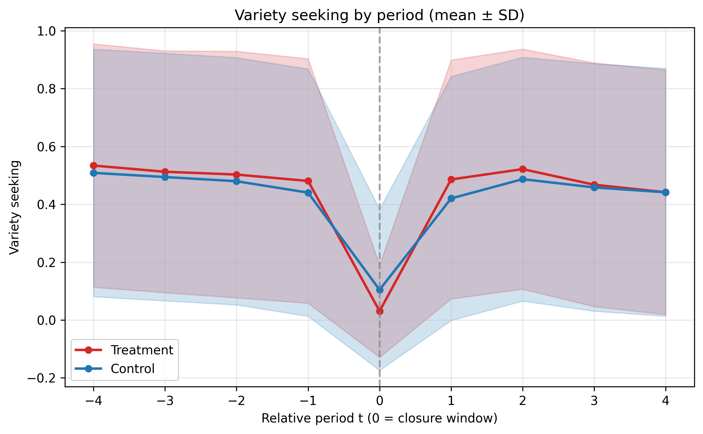

# Research Question and Goal

## Research Question

Do temporary store closures change customers' product exploration behavior, and does the displacement channel moderate this effect?

## Goal

To estimate closure effects on variety seeking using the DDD framework with an **unbalanced panel** (members not required to purchase in every period), and **distinct mode** outcome definition.

This run uses `--no-balanced-panel`, which disables both the balanced-panel filter and the period-0 cleaning, so all members are retained.

The model is DDD because the panel is unbalanced.

# Methodology Summary (Pseudo Code)

## 1. Outcome Construction

```
LOAD order_commodity_result_processed.csv

FOR each (member_id, product_id):
    first_date = min(purchase_date)

FOR each closure event e and relative period t in {-4,-3,-2,-1,1,2,3,4}:
    window = period_bounds(e, t)
    window purchases = purchases with date in window

    IF mode == distinct:
        denominator = count(unique product_id in window)
        numerator   = count(unique product_id first purchased on/after window_start)

    variety_seeking = numerator / denominator
```

## 2. Sample Filters

```
Start from displacement_scores_t0_ex_ante
Restrict to closure events retained in closure_pair_registry.csv
Exclude period t = 0 from regression panel
Unbalanced panel: keep all member-closure pairs (no balanced-panel filter)
No period-0 cleaning (all members retained regardless of closure-window purchases)
```

## 3. DDD and Event-Study Specifications

```
Run collapsed Spec B and Spec C
Run event-study Spec A / B / C / D

Fixed effects:
    event_fe_id + rel_t + calendar_month

Cluster standard errors by:
    member_id
```

# Results Summary

This report summarizes the distinct-mode run:

- `outputs/displacement_effect_estimation/variety_seeking_unbalanced`

## Sample Characteristics

| Metric | Value |
|--------|-------|
| Unique closures analyzed | 22 |
| Unique members in score data | 44,858 |
| Estimation observations (non-missing) | 113,269 |
| Total panel rows | 358,864 |
| Relative periods | -4, -3, -2, -1, 1, 2, 3, 4 |
| Balanced panel | No |
| Period-0 cleaning | No |
| Model type | DDD |

## Trend Visualization

[Distinct-mode variety trend plot](../outputs/displacement_effect_estimation/variety_seeking_unbalanced/variety_panel_trend_mean_sd.png)



The trend plot shows treatment-group variety is non-zero in period 0 (mean = 0.031), since period-0 cleaning is no longer applied.
Pre-period levels are broadly similar between treatment and control groups.
Post-period variety drops modestly relative to pre-period levels.

In the unbalanced panel, the sample is much larger (44,858 vs 1,723 members) because members with missing periods are retained.
NaN observations are excluded from regression (yielding 113,269 estimation rows from 358,864 panel rows, about 31.6% utilization).

## Variety-Seeking DDD Estimation Results

### Binary Displacement Model (collapsed)

$$
\begin{align}
Y_{iet} &= \delta^B \cdot \mathbf{1}(\text{post}_{t}) \times \mathbf{1}(\text{Treated}_{ie})
         + \beta \cdot \mathbf{1}(\text{post}_{t}) \times D_{ie} \\
        &+ \delta^D \cdot \mathbf{1}(\text{post}_{t})
          \times \mathbf{1}(\text{Treated}_{ie}) \times D_{ie}
         + \phi_{ie} + \omega_t + \gamma_m + \varepsilon_{iet}
\end{align}
$$

| Variable | Coef (SE) |
|----------|---------------|
| post x treated | 0.031*** (0.011) |
| post x disp | 0.036*** (0.006) |
| post x treated x disp | -0.039*** (0.014) |
| Period FE | Yes |
| Event FE | Yes |
| Calendar-month FE | Yes |
| Observations | 113,269 |
| Within $R^2$ | 0.0005 |

Notes: Standard errors in parentheses. * p<0.1, ** p<0.05, *** p<0.01. Clustered by member_id.

The DDD estimates show a statistically significant displacement-channel effect. The triple interaction (`post x treated x disp`) is negative and significant (p=0.005), indicating that displacement propensity **reduces** the treatment effect on variety seeking.

The baseline treatment effect for non-displaced consumers is positive and significant at 0.031. The displacement level shift (`post x disp`) is positive and significant at 0.036. The net treated-displaced effect = 0.031 + 0.036 - 0.039 = 0.028.

### Score-Based Model (collapsed)

| Variable | Coef (SE) |
|----------|---------------|
| post x treated | 0.021** (0.010) |
| post x score | 0.052*** (0.009) |
| post x treated x score | -0.047** (0.021) |
| Period FE | Yes |
| Event FE | Yes |
| Calendar-month FE | Yes |
| Observations | 113,269 |
| Within $R^2$ | 0.0004 |

The score-based model shows a significant baseline treatment effect and positive displacement propensity relationship. The triple interaction is negative and significant (p=0.024), consistent with the binary model: higher predicted displacement propensity **reduces** the the treatment effect on variety seeking.

## Dynamic Effects of Closure

### Event ATT

The event-study ATT specification estimates the treated-control gap period by period, relative to $t = -1$:

$$
\begin{align*}
Y_{iet} = \sum_{\ell \in \mathcal{L}} \delta_{\ell}
           \cdot \mathbf{1}(t = \ell) \times \mathbf{1}(\text{Treated}_{ie})
         + \phi_{ie} + \omega_t + \gamma_m + \varepsilon_{iet}
\end{align*}
$$

| Period | $\delta_\ell$ (SE) | p |
|---|---|---:|
| -4 | -0.0138 (0.0120) | 0.249 |
| -3 | -0.0032 (0.0121) | 0.791 |
| -2 | -0.0177 (0.0117) | 0.129 |
| 1 | 0.0295** (0.0123) | 0.017 |
| 2 | -0.0033 (0.0125) | 0.790 |
| 3 | -0.0238* (0.0125) | 0.058 |
| 4 | -0.0126 (0.0125) | 0.316 |

The ATT shows a significant positive effect only in period 1 (p=0.017). The post-closure effect fades quickly. Pre-period estimates are not significantly different from zero, supporting parallel pre-trends.

### Dynamic Binary DDD

The event-study triple-difference specification estimates both baseline and displacement effects period by period:

| Period | $\delta^B_\ell$ (SE) | $\delta^D_\ell$ (SE) |
|---|---|---|
| -4 | -0.031 (0.022) | 0.028 (0.026) |
| -3 | -0.015 (0.022) | 0.018 (0.026) |
| -2 | -0.025 (0.023) | 0.010 (0.026) |
| 1 | 0.032 (0.022) | -0.003 (0.026) |
| 2 | 0.019 (0.022) | -0.036 (0.027) |
| 3 | -0.004 (0.022) | -0.010 (0.031) |
| 4 | 0.006 (0.022) | 0.011 (0.027) |

No post-closure period shows a significant displacement-channel effect. The displacement terms ($\delta^D$) are all insignificant across periods 1-4.

### Dynamic Score DDD

The score-based event-study displacement slope:

| Period | $\delta^B_\ell$ (SE) | $\delta^S_\ell$ (SE) |
|---|---|---|
| -4 | -0.027 (0.018) | 0.045 (0.039) |
| -3 | -0.011 (0.019) | 0.025 (0.039) |
| -2 | -0.026 (0.020) | 0.025 (0.040) |
| 1 | 0.026 (0.019) | 0.016 (0.039) |
| 2 | 0.006 (0.018) | -0.031 (0.039) |
| 3 | -0.013 (0.018) | -0.038 (0.039) |
| 4 | -0.000 (0.019) | -0.045 (0.040) |

The score-slope terms are flat across post periods; `post x treated x score`  is insignificant in all post-closure periods. `post x score` is significant and growing over time: period 2: 0.094*** (SE=0.017), period 3: 0.110*** (SE=0.018), period 4: 0.118*** (SE=0.017).

## Pre-trend Tests

$$
H_0: \gamma_{-4} = \gamma_{-3} = \gamma_{-2} = 0
$$

| Specification | Test | p-value | Result |
|---------------|------|--------:|--------|
| event_att | pretrend_att_joint_zero | 0.356 | Parallel trends (Yes) |
| event_binary_B | pretrend_baseline_joint_zero | 0.500 | Parallel trends (Yes) |
| event_binary_B | pretrend_displacement_joint_zero | 0.733 | Parallel trends (Yes) |
| event_binary_D | pretrend_length_displacement_joint_zero | 0.002 | Potential violation (Concern) |
| event_binary_D | pretrend_length_baseline_joint_zero | 0.029 | Potential violation (Concern) |
| event_score_C | pretrend_score_baseline_joint_zero | 0.396 | Parallel trends (Yes) |
| event_score_C | pretrend_score_slope_joint_zero | 0.718 | Parallel trends (Yes) |

Core Specs A, B, C show acceptable pre-trend support. Spec D raises concerns about closure-length heterogeneity. The score-based specification (C) is reassuring.

# Main Findings

1. **The unbalanced panel DDD shows a statistically significant displacement-channel effect on variety seeking.**

   Both binary and score-based DDD, triple interaction is negative and significant (p=0.005). Higher displacement propensity **reduces** the the treatment effect on variety seeking.

2. **The baseline treatment effect is positive and significant in the collapsed spec, but the event-study ATT shows a significant effect only in period 1 (0.030, p=0.017).**

   The period-1 effect is driven by the positive `post x treated` coefficient in the binary DDD (`post x treated` = 0.032 in Spec B), suggesting the baseline treatment effect is concentrated in the early post-period.

3. **Sample composition differs markedly from the balanced panel.**

   The unbalanced panel has 44,858 members (vs 1,723 in the balanced panel). Many members have no purchases in some periods, resulting in NaN variety_seeking values which are dropped from regression (yielding 113,269 estimation rows). The period-0 variety is no longer mechanically zero because period-0 cleaning is not not applied.

4. **Parallel trends are supported in Specs A, B, C but but but Spec D shows potential violations related to closure-length heterogeneity.**

# Generated Outputs

- `outputs/displacement_effect_estimation/variety_seeking_unbalanced/estimation_sample.csv`
- `outputs/displacement_effect_estimation/variety_seeking_unbalanced/ddd_binary_results.csv`
- `outputs/displacement_effect_estimation/variety_seeking_unbalanced/ddd_score_results.csv`
- `outputs/displacement_effect_estimation/variety_seeking_unbalanced/event_study_results.csv`
- `outputs/displacement_effect_estimation/variety_seeking_unbalanced/pretrend_joint_tests.csv`
- `outputs/displacement_effect_estimation/variety_seeking_unbalanced/variety_panel_trend_mean_sd.png`
- `outputs/displacement_effect_estimation/variety_seeking_unbalanced/variety_panel_trend_stats.csv`
