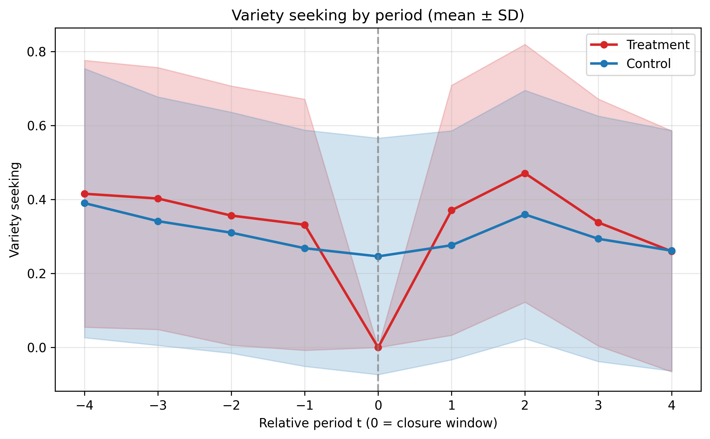
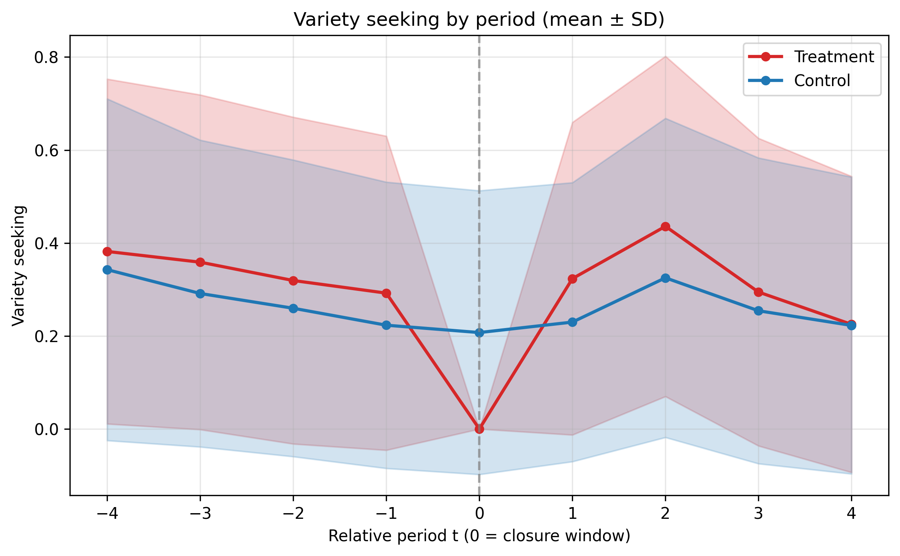

# Research Question and Goal

## Research Question

Do temporary store closures change customers' product exploration behavior, and is any change stronger for consumers predicted to be displaced by the closure?

## Goal

To estimate closure effects on variety seeking using the same Difference-in-Differences / Triple Difference-in-Differences framework as the purchase-frequency analysis, under two implemented outcome definitions:

1. **Distinct mode**: each product is counted once per member-period window
2. **Instance mode**: each purchase row is counted, so repeated purchases receive more weight

# Methodology Summary (Pseudo Code)

## 1. Variety-Seeking Outcome Construction

```
LOAD order_commodity_result_processed.csv

FOR each (member_id, product_id):
    first_date = min(purchase_date)

FOR each closure event e:
    FOR each relative period t in {-4,-3,-2,-1,1,2,3,4}:
        window = period_bounds(e, t)
        window purchases = purchases with date in window

        IF mode == distinct:
            denominator = count(unique product_id in window)
            numerator   = count(unique product_id first purchased on/after window_start)
        ELSE IF mode == instance:
            denominator = count(purchase rows in window)
            numerator   = count(purchase rows whose product first purchased on/after window_start)

        variety_seeking = numerator / denominator
```

## 2. Sample Filters Used in These Runs

```
Start from displacement_scores_t0_ex_ante
Restrict to closure events retained in closure_pair_registry.csv

For outcome = variety_seeking:
    - exclude period t = 0 from regression panel
    - require balanced panel by default
      (member-closure pair must have non-missing variety in all 8 periods)
    - apply period-0 cleaning:
        treated with purchase in closure window      -> drop
        control without purchase in closure window   -> drop
```

## 3. DDD and Event-Study Specifications

```
Run collapsed Spec B and Spec C
Run event-study Spec A / B / C / D

Fixed effects:
    event_fe_id + rel_t + calendar_month

Cluster standard errors by:
    member_id
```

# Results Summary

This report summarizes two implemented runs:

- `outputs/displacement_effect_estimation/variety_seeking`
- `outputs/displacement_effect_estimation/variety_seeking_instance`

## Sample Characteristics

| Metric | Distinct mode | Instance mode |
|--------|---------------|---------------|
| Unique closures analyzed | 22 | 22 |
| Unique customers in panel | 1,723 | 1,723 |
| Treatment customers | 308 | 308 |
| Control customers | 1,415 | 1,415 |
| Total observations | 13,784 | 13,784 |
| Relative periods | -4, -3, -2, -1, 1, 2, 3, 4 | -4, -3, -2, -1, 1, 2, 3, 4 |
| Balanced panel | Yes | Yes |
| Period-0 cleaning | Yes | Yes |

## Trend Visualization

[Distinct-mode variety trend plot](../outputs/displacement_effect_estimation/variety_seeking/variety_panel_trend_mean_sd.png)

[Instance-mode variety trend plot](../outputs/displacement_effect_estimation/variety_seeking_instance/variety_panel_trend_mean_sd.png)

Distinct mode:



Instance mode:



The trend plots show a similar shape across counting rules. In both runs, treatment-group average variety is higher than control in the first two post-closure periods, with the gap largest at period 2. Because treated members with closure-window purchases are dropped by construction, the treatment mean at $t = 0$ is mechanically zero in the helper plot.

## Variety-Seeking DDD Estimation Results

### Binary Displacement Model (collapsed)

$$
\begin{align}
Y_{iet} &= \delta^B \cdot \mathbf{1}(\text{post}_{t}) \times \mathbf{1}(\text{Treated}_{ie})
         + \beta \cdot \mathbf{1}(\text{post}_{t}) \times D_{ie} \\
        &\quad + \delta^D \cdot \mathbf{1}(\text{post}_{t})
           \times \mathbf{1}(\text{Treated}_{ie}) \times D_{ie}
         + \phi_{ie} + \omega_t + \gamma_m + \varepsilon_{iet}
\end{align}
$$

| Variable | Distinct mode | Instance mode |
|----------|---------------|---------------|
| post x treated | 0.0841 (0.0863) | 0.0819 (0.0869) |
| post x disp | 0.1011* (0.0523) | 0.1080** (0.0530) |
| post x treated x disp | -0.0426 (0.0873) | -0.0514 (0.0880) |
| Period FE | Yes | Yes |
| Event FE | Yes | Yes |
| Calendar-month FE | Yes | Yes |
| Observations | 13,784 | 13,784 |
| Within $R^2$ | 0.0015 | 0.0013 |

Notes: Standard errors in parentheses. * p<0.1, ** p<0.05, *** p<0.01.

The binary DDD estimates do not show a statistically meaningful displacement-channel effect on variety seeking. The triple interaction is small and negative in both counting modes, with p-values 0.626 and 0.559. The only borderline significant term is `post x disp`, suggesting a post-period level shift for displaced consumers pooled across treatment and control.

The binary specification implies the following four-group comparison for post-closure changes:

|                        | Non-displaced ($D = 0$) | Displaced ($D = 1$) |
|------------------------|-------------------------|---------------------|
| **Control ($T = 0$)**  | 0 | $\beta$ |
| **Treated ($T = 1$)**  | $\delta^B$ | $\delta^B + \beta + \delta^D$ |

Using the point estimates:

- Distinct mode: treated-displaced post effect = $0.0841 + 0.1011 - 0.0426 = 0.1426$
- Instance mode: treated-displaced post effect = $0.0819 + 0.1080 - 0.0514 = 0.1385$

### Score-Based Model (collapsed)

| Variable | Distinct mode | Instance mode |
|----------|---------------|---------------|
| post x treated | 0.0419*** (0.0143) | 0.0324** (0.0144) |
| post x score | 0.0854* (0.0496) | 0.1156** (0.0501) |
| post x treated x score | -0.0767 (0.0992) | -0.0730 (0.1015) |
| Period FE | Yes | Yes |
| Event FE | Yes | Yes |
| Calendar-month FE | Yes | Yes |
| Observations | 13,784 | 13,784 |
| Within $R^2$ | 0.0011 | 0.0012 |

The score-based model shows a positive and statistically significant baseline post effect for treated customers in both modes. However, the interaction between treatment and predicted displacement propensity remains insignificant, so the implementation does not support a robust score-scaled displacement effect on variety seeking.

## Dynamic Effects of Closure

### Event ATT

The event-study ATT specification estimates the treated-control gap period by period, relative to the omitted pre-period $t = -1$:

$$
\begin{align*}
Y_{iet} = \sum_{\ell \in \mathcal{L}} \delta_{\ell}
           \cdot \mathbf{1}(t = \ell) \times \mathbf{1}(\text{Treated}_{ie})
         + \phi_{ie} + \omega_t + \gamma_m + \varepsilon_{iet}
\end{align*}
$$

| Period | Distinct $\delta_\ell$ (SE) | p | Instance $\delta_\ell$ (SE) | p |
|---|---|---|---|---|
| -4 | -0.0283 (0.0277) | 0.307 | -0.0244 (0.0271) | 0.368 |
| -3 | 0.0029 (0.0276) | 0.917 | 0.0010 (0.0273) | 0.971 |
| -2 | -0.0226 (0.0258) | 0.381 | -0.0167 (0.0251) | 0.507 |
| 1 | 0.0493* (0.0279) | 0.077 | 0.0410 (0.0275) | 0.136 |
| 2 | 0.0505* (0.0280) | 0.072 | 0.0415 (0.0280) | 0.138 |
| 3 | 0.0305 (0.0275) | 0.267 | 0.0176 (0.0264) | 0.504 |
| 4 | -0.0166 (0.0254) | 0.514 | -0.0213 (0.0254) | 0.401 |

The dynamic ATT pattern is similar under both definitions. Variety seeking rises modestly in post-periods 1 and 2, especially in distinct mode, but the estimates do not persist through periods 3 and 4.

### Dynamic Binary DDD

The event-study triple-difference specification estimates both the baseline effect $\delta^B_\ell$ and the displacement effect $\delta^D_\ell$ at each relative period:

$$
\begin{align*}
Y_{iet} &= \sum_{\ell \in \mathcal{L}} \delta^B_{\ell}
             \cdot \mathbf{1}(t = \ell) \times \mathbf{1}(\text{Treated}_{ie})
         + \sum_{\ell \in \mathcal{L}} \delta^D_{\ell}
             \cdot \mathbf{1}(t = \ell)
             \times \mathbf{1}(\text{Treated}_{ie}) \times D_{ie} \\
        &\quad
         + \sum_{\ell \in \mathcal{L}} \beta_{\ell}
             \cdot \mathbf{1}(t = \ell) \times D_{ie}
         + \phi_{ie} + \omega_t + \gamma_m + \varepsilon_{iet}
\end{align*}
$$

| Period | Distinct $\delta^D_\ell$ (SE) | p | Instance $\delta^D_\ell$ (SE) | p |
|---|---|---|---|---|
| -4 | 0.2665* (0.1517) | 0.079 | 0.2079 (0.1622) | 0.200 |
| -3 | 0.0481 (0.1826) | 0.792 | 0.0758 (0.1767) | 0.668 |
| -2 | 0.0997 (0.1552) | 0.521 | 0.1286 (0.1455) | 0.377 |
| 1 | 0.0580 (0.1669) | 0.728 | 0.0687 (0.1646) | 0.676 |
| 2 | 0.1093 (0.1544) | 0.479 | 0.0759 (0.1551) | 0.625 |
| 3 | 0.0796 (0.1883) | 0.673 | 0.0556 (0.1803) | 0.758 |
| 4 | -0.0040 (0.1330) | 0.976 | 0.0058 (0.1296) | 0.964 |

No post-closure period shows a significant displacement-channel effect in either counting mode. The only borderline estimate appears in the distinct-mode pre-period at $t=-4$, which is precisely the kind of movement the joint pre-trend tests are designed to diagnose.

### Dynamic Score DDD

For completeness, the score-based event-study displacement slope is also flat:

| Period | Distinct $\delta^S_\ell$ (p) | Instance $\delta^S_\ell$ (p) |
|---|---:|---:|
| -4 | 0.2325 (0.207) | 0.1050 (0.580) |
| -3 | 0.0517 (0.798) | 0.0463 (0.814) |
| -2 | 0.1017 (0.584) | 0.1120 (0.531) |
| 1 | 0.0514 (0.793) | 0.0396 (0.839) |
| 2 | 0.0606 (0.736) | 0.0211 (0.907) |
| 3 | 0.1194 (0.566) | 0.0484 (0.807) |
| 4 | -0.1549 (0.352) | -0.1400 (0.397) |

These results line up with the collapsed score model: the baseline treatment effect can be positive, but the slope with respect to displacement propensity is not precisely estimated.

## Pre-trend Testing Methodology

The parallel-trends logic is the same as in the main report. For each event-study specification, we test whether all pre-period interaction terms are jointly zero:

$$
H_0: \gamma_{-4} = \gamma_{-3} = \gamma_{-2} = 0
$$

A p-value above 0.05 indicates no evidence against the identifying trend restriction; a p-value below 0.05 flags a potential concern.

## Pre-trend Tests

| Specification | Test | Distinct p-value | Instance p-value | Result |
|---------------|------|-----------------:|-----------------:|--------|
| event_att | pretrend_att_joint_zero | 0.525 | 0.686 | Parallel trends (Yes) |
| event_binary_B | pretrend_baseline_joint_zero | 0.106 | 0.315 | Parallel trends (Yes) |
| event_binary_B | pretrend_displacement_joint_zero | 0.187 | 0.428 | Parallel trends (Yes) |
| event_binary_D | pretrend_length_displacement_joint_zero | 0.027 | 0.045 | Potential violation (Concern) |
| event_binary_D | pretrend_length_baseline_joint_zero | 0.024 | 0.043 | Potential violation (Concern) |
| event_score_C | pretrend_score_baseline_joint_zero | 0.537 | 0.683 | Parallel trends (Yes) |
| event_score_C | pretrend_score_slope_joint_zero | 0.589 | 0.890 | Parallel trends (Yes) |

The key message is that the core Spec A, Spec B, and Spec C identifying restrictions look acceptable in both counting modes. The caution is concentrated in Spec D, where closure-length interaction pre-trends are rejected.

# Main Findings

1. **Baseline post-closure variety seeking increases modestly for treated customers.**

   In the collapsed score specification, `post x treated` is positive and statistically significant in both distinct mode (0.0419, p=0.003) and instance mode (0.0324, p=0.025).

2. **There is no robust displacement-channel effect on variety seeking.**

   Both the binary and score-based triple interactions are statistically insignificant in the collapsed models, and the event-study displacement terms remain small and noisy across post periods.

3. **Distinct and instance counting rules lead to the same qualitative conclusion.**

   Distinct mode produces slightly larger treatment-path coefficients in periods 1 and 2, but the substantive interpretation is unchanged.

4. **The main identifying concern is limited to closure-length heterogeneity tests.**

   Spec D pre-trend tests fail in both runs, so any interpretation of length-interaction estimates should be cautious. The core ATT and DDD specifications are more reassuring.

# Generated Outputs

## Distinct-Mode Files

- `outputs/displacement_effect_estimation/variety_seeking/estimation_sample.csv`
- `outputs/displacement_effect_estimation/variety_seeking/ddd_binary_results.csv`
- `outputs/displacement_effect_estimation/variety_seeking/ddd_score_results.csv`
- `outputs/displacement_effect_estimation/variety_seeking/event_study_results.csv`
- `outputs/displacement_effect_estimation/variety_seeking/pretrend_joint_tests.csv`
- `outputs/displacement_effect_estimation/variety_seeking/variety_panel_trend_mean_sd.png`
- `outputs/displacement_effect_estimation/variety_seeking/variety_panel_trend_stats.csv`

## Instance-Mode Files

- `outputs/displacement_effect_estimation/variety_seeking_instance/estimation_sample.csv`
- `outputs/displacement_effect_estimation/variety_seeking_instance/ddd_binary_results.csv`
- `outputs/displacement_effect_estimation/variety_seeking_instance/ddd_score_results.csv`
- `outputs/displacement_effect_estimation/variety_seeking_instance/event_study_results.csv`
- `outputs/displacement_effect_estimation/variety_seeking_instance/pretrend_joint_tests.csv`
- `outputs/displacement_effect_estimation/variety_seeking_instance/variety_panel_trend_mean_sd.png`
- `outputs/displacement_effect_estimation/variety_seeking_instance/variety_panel_trend_stats.csv`
